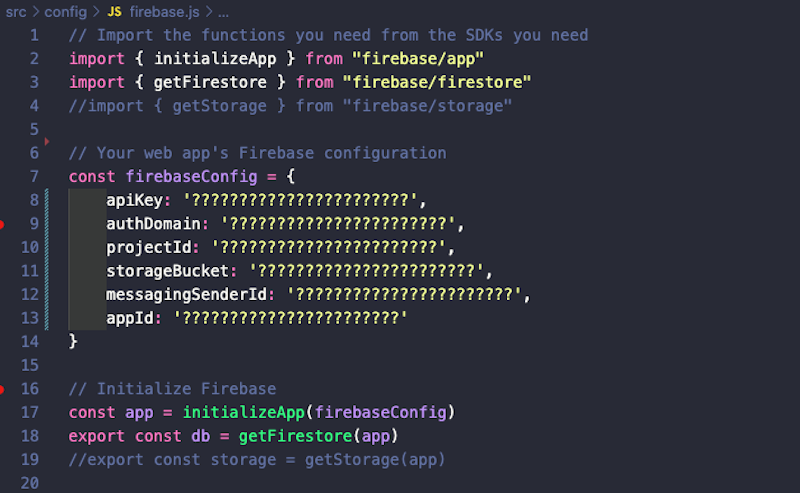

# Coderhouse - Comisión 60745 - React Flex

**Entrega final**

# Tienda de donas con React Vite

En este proyecto se implementó una aplicación web desarrollada en React utilizando Vite, en el marco del curco React Flex de Coderhouse en durante Abril y Mayo de 2024

## Funcionalidades

- **Explorar** Los usuarios pueden ver una lista de los productos disponibles con detalles como nombre, descripción y precio.
- **Agregar al carrito:** Los usuarios pueden agregar productos al carrito de compras.
- **Ver carrito:** Los usuarios pueden ver los productos que han agregado al carrito, así como el total de la compra.
- **Realizar pedido:** Los usuarios pueden finalizar el pedido.

## Capturas de pantalla

Página de inicio con vista de los productos disponibles

Vista del carrito de compras donde los usuarios pueden revisar y modificar sus pedidos

Vista del formulario final para comletar la compra

## Instalación y uso

Para ejecutar este proyecto localmente, sigue estos pasos:

1. Clona este repositorio en tu máquina local.
2. Navega al directorio del proyecto.
3. Instala las dependencias utilizando `npm install`.
4. Antes de ejecutar la aplicaciòn ver la sección "Uso de Firebase"
5. Ejecuta la aplicación con `npm run dev`.
6. La aplicación estará disponible en tu navegador en ` http://localhost:5173/`.

Asimismo el deploy del proyecto se encuentra disponible para su uso en: coderhouse-react-proyecto-final.vercel.app

## Uso de Firebase

Es necesario crear la base de datos relacionada al proyecto en Firebase. Para ello editar el archivo /src/config/firebase.js colocando los datos de conexión a una base de datos de tu cuenta de Firebase.

Luego ejecutar el script de carga de datos des la la terminal con el comando: node /scripts/firebaseConfig.js

## Contribuir

Si quieres contribuir a este proyecto, sigue estos pasos:

1. Realiza un fork del repositorio.
2. Crea una nueva rama para tus cambios (`git checkout -b feature/nueva-caracteristica`).
3. Realiza tus cambios y haz commit (`git commit -am 'Agrega una nueva característica'`).
4. Sube tus cambios a tu repositorio fork (`git push origin feature/nueva-caracteristica`).
5. Abre un pull request en este repositorio.

## Tecnologías y módulos utilizados

- React
- Vite
- HTML
- CSS
- JavaScript
- ChakraUI
- SweetAlert2
- Animated.css
- Firebase
- Vercel

## Créditos y licencia

Versión con fines educativos. Las marcas y logotipos no son reales. Este proyecto está bajo licencia MIT. Consulta el archivo `LICENSE` para más detalles.
