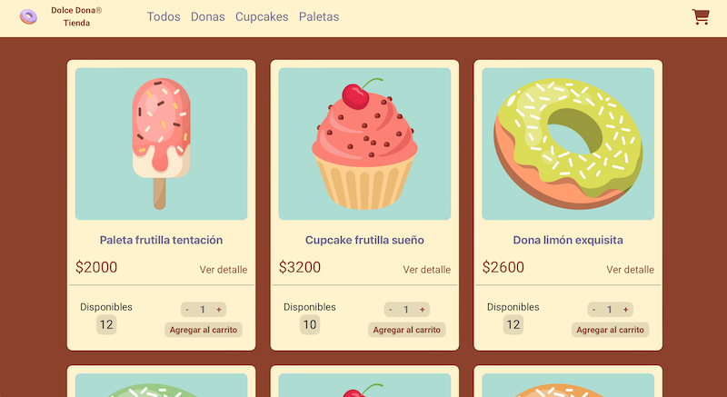
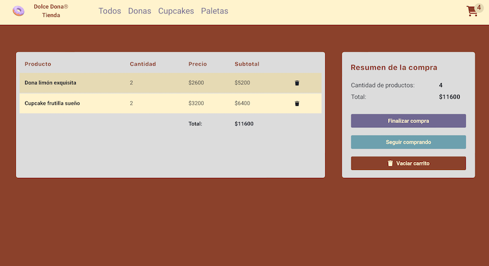
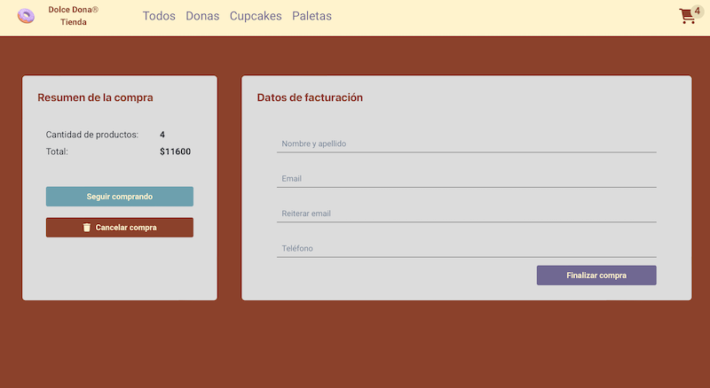

# Coderhouse - Comisión 60745 - React Flex

**Entrega final**

# Tienda de donas con React Vite

Este es el proyecto de una aplicación web desarrollada en React utilizando Vite, realizada en el marco del curco React Flex de Coderhouse en durante Abril y Mayo de 2024

## Funcionalidades

- **Explorar** Los usuarios pueden ver una lista de donas disponibles con detalles como nombre, descripción y precio.
- **Agregar al carrito:** Los usuarios pueden agregar donas al carrito de compras.
- **Ver carrito:** Los usuarios pueden ver las donas que han agregado al carrito, así como el total de la compra.
- **Realizar pedido:** Los usuarios pueden proceder a realizar el pedido de las donas en su carrito.

## Capturas de pantalla

Página de inicio con vista de los productos disponibles

Vista del carrito de compras donde los usuarios pueden revisar y modificar sus pedidos

Vista del formulario final para comletar la compra

## Instalación y uso

Para ejecutar este proyecto localmente, sigue estos pasos:

1. Clona este repositorio en tu máquina local.
2. Navega al directorio del proyecto.
3. Instala las dependencias utilizando `npm install`.
4. Ejecuta la aplicación con `npm run dev`.
5. La aplicación estará disponible en tu navegador en ` http://localhost:5173/`.

## Uso de Firebase

Al tratarse de una versión educativa, se han mantenid de manera pública los datos de conexion a Firebase. En una versión comercial el archivo .env con los valores de las variables de entorno no debe compartirse.

## Contribuir

Si quieres contribuir a este proyecto, sigue estos pasos:

1. Realiza un fork del repositorio.
2. Crea una nueva rama para tus cambios (`git checkout -b feature/nueva-caracteristica`).
3. Realiza tus cambios y haz commit (`git commit -am 'Agrega una nueva característica'`).
4. Sube tus cambios a tu repositorio fork (`git push origin feature/nueva-caracteristica`).
5. Abre un pull request en este repositorio.

## Tecnologías y módulos utilizados

- React
- Vite
- HTML
- CSS
- JavaScript
- ChakraUI
- SweetAlert2
- Animated.css
- Firebase

## Créditos y licencia

Versión con fines educativos. Las marcas y logotipos no son reales. Este proyecto está bajo licencia MIT. Consulta el archivo `LICENSE` para más detalles.
